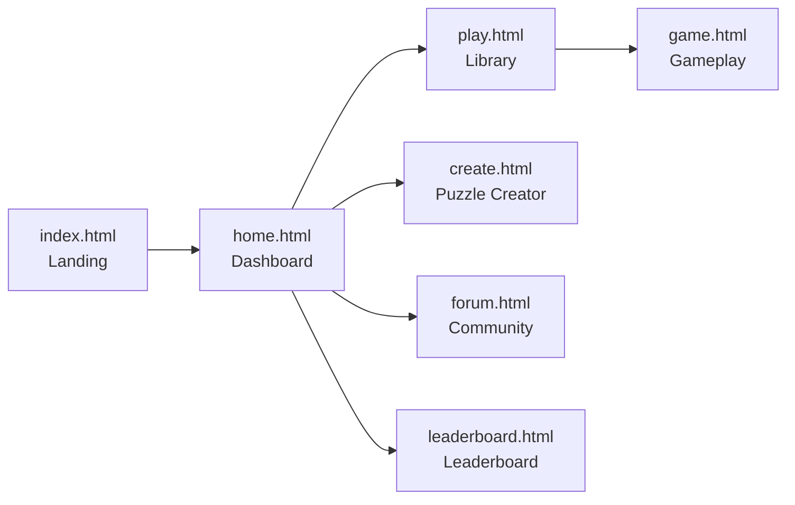

# CrossQuest

<p align="center">
  
</p>

<p align="center">
  <strong>A complete crossword web experience built with HTML, CSS, and Vanilla JavaScript.</strong>
</p>

<p align="center">
  
  
  
  
</p>

<p align="center">
  <em>Think fast. Solve smart. Build your own crossword universe.</em>
</p>

---

## Quick Navigation

- [Live Overview](#crossquest)
- [Screenshots](#screenshots)
- [Demo Video--GIF](#demo-video--gif)
- [Why This Project Stands Out](#why-this-project-stands-out)
- [Project Architecture](#project-architecture)
- [User Flow](#user-flow)
- [Quick Start](#quick-start)
- [Demo Checklist (for Teacher/Viva)](#demo-checklist-for-teacherviva)

## Screenshots

> Add your real screenshots to a `docs/screenshots/` folder and keep these names for instant display.

| Landing | Dashboard |
|---|---|
|  |  |

| Play Library | Gameplay |
|---|---|
|  |  |

| Creator | Forum + Leaderboard |
|---|---|
|  |  |

## Demo Video / GIF

> Export a short walkthrough (20-40s) and save it as `docs/demo.gif`.


CrossQuest is a multi-page front-end case study that simulates a real puzzle product flow:

- Landing page
- Dashboard
- Puzzle library
- Active gameplay
- Puzzle creator
- Community forum
- Leaderboard

## Why This Project Stands Out

- Product-like flow across multiple pages instead of a single static page
- Interactive crossword gameplay with timer and score mechanics
- Built-in puzzle creation workflow with grid editing and clue management
- Consistent visual design system and reusable shared styles
- Mobile-first usability improvements across navigation and forms

## Built With

- HTML5
- CSS3 (custom tokens + responsive media queries)
- Vanilla JavaScript (DOM logic + localStorage)
- Font Awesome icons
- Google Fonts (`Nunito`)

## Project Architecture

```text
.
├── index.html            # Landing page
├── home.html             # Dashboard
├── play.html             # Puzzle library
├── game.html             # Gameplay screen
├── create.html           # Puzzle creator
├── forum.html            # Community page
├── leaderboard.html      # Leaderboard page
├── style.css             # Shared design system and layout
├── landing.css           # Landing styles
├── home.css              # Dashboard styles
├── play.css              # Library styles
├── game.css              # Gameplay styles
├── create.css            # Creator styles
├── community.css         # Shared forum + leaderboard styles
├── script.js             # Main app logic
├── game.js               # Game page helper logic
└── logo.png              # Branding asset
```

## User Flow



## Page Breakdown

| Page | Purpose | Key Interactions |
|---|---|---|
| `index.html` | First impression / entry | Animated landing + start CTA |
| `home.html` | Main hub | Bento cards for progress, quests, quick actions |
| `play.html` | Puzzle catalog | Browse topics and start a puzzle |
| `game.html` | Crossword gameplay | Across/Down clues, timer, score, submit/reset |
| `create.html` | Puzzle authoring | Grid tools, size controls, clue editor |
| `forum.html` | Community UI | Compose and view discussion feed |
| `leaderboard.html` | Ranking UI | Podium + list with filter tabs |

## Feature Set

- Shared sidebar navigation across app pages
- Responsive mobile menu (`.mobile-toggle`)
- Local puzzle/topic handling via JavaScript data structures
- Local persistence with `localStorage`
- Creator workflow from empty grid to clue list

## Quick Start

### 1. Clone and open folder

```bash
git clone <your-repo-url>
cd "Html css js case study 2"
```

### 1.1 Optional: open in VS Code

```bash
code .
```

### 2. Run a local server (recommended)

```bash
python3 -m http.server 5502
```

### 3. Open in browser

```text
http://127.0.0.1:5502
```

### Alternative

You can open `index.html` directly, but a local server is better for consistent browser behavior.

## Demo Checklist (for Teacher/Viva)

Use this sequence during your explanation:

1. Show design system in `style.css` (tokens + shared layout).
2. Walk through page flow: `index -> home -> play -> game`.
3. Explain state/data handling in `script.js`.
4. Demo creator flow in `create.html` (size + tools + clues).
5. Show responsive behavior in mobile view.

## Code Quality Notes

- Unused and redundant styles were cleaned safely.
- Important explanatory comments were added across HTML, CSS, and JS files.
- Mobile usability fixes were prioritized without changing core product behavior.

## Roadmap

- Add backend APIs for user accounts and cloud sync
- Convert forum/leaderboard into real data-driven modules
- Add puzzle import/export (`.json`)
- Add automated test coverage for gameplay and creator logic

## Author

Created as a front-end case study project focused on product UX, interaction flow, and responsive implementation.

## License

This project is for educational/demo use. Add a `LICENSE` file if you plan to publish with a specific open-source license.

---

If this project helped you, consider starring the repository.
